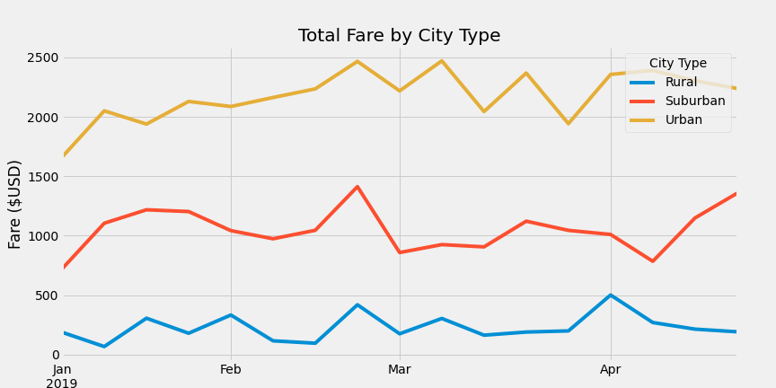

# PyBer_Analysis
## Overview of the analysis:
The president of PyBer, a company valued at $2.3 Bil, asked for a ride-sharing data with respect to rural, suburban & urban city types.  Using Pandas and Matplotlib, a graph was created that shows the total weekly fares for each city type for a period of four months.

## Results:

## Summary:

Based on the analysis there are three recomendations to the president of PyBer.

